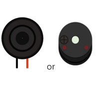
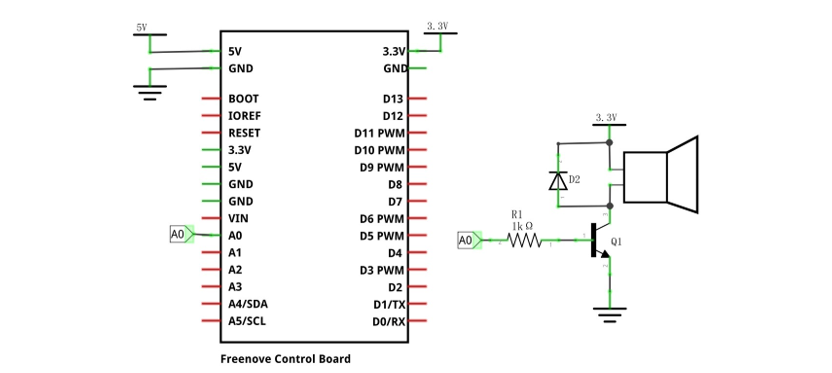
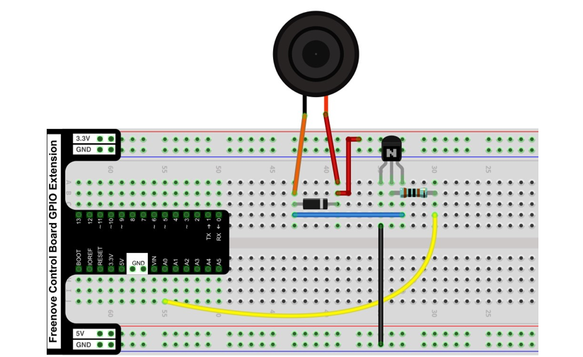

##############################################################################
Chapter DAC
##############################################################################

In this chapter, we learn about DAC (Digital to Analog Converter). The Control board (V5) has a built-in DAC (Digital to Analog Converter) which is used to convert digital signals into analog signals.

Project DAC
******************************

In this project, let's learn the DAC function of the control board and use it to control a passive buzzer to play music.

Component List
==================================

+------------------------------------------------------+
| Control board x1                                     |
|                                                      |
| |Chapter01_00|                                       |
+--------------------------+---------------------------+
| Breadboard x1            | GPIO Extension Board x1   |
|                          |                           |
| |Chapter02_00|           | |Chapter02_01|            |
+------------------+-------+---------------------------+
| USB cable x1     | Jumper M/M x6                     |
|                  |                                   |
| |Chapter01_02|   | |Chapter01_03|                    |
+------------------+-----------------+-----------------+
|Speaker or Passive| Resistor 1kΩ x1 | NPN transistorx1|
|                  |                 |                 |
| buzzer x1        |                 |                 |
|                  |                 |                 |
| |Chapter11_00|   | |Chapter10_10|  | |Chapter10_00|  |
+------------------+-----------------+-----------------+

.. |Chapter01_00| image:: ../_static/imgs/1_LED_Blink/Chapter01_00.png
.. |Chapter01_02| image:: ../_static/imgs/1_LED_Blink/Chapter01_02.png
.. |Chapter01_03| image:: ../_static/imgs/1_LED_Blink/Chapter01_03.png
.. |Chapter02_00| image:: ../_static/imgs/2_Two_LEDs_Blink/Chapter02_00.png
.. |Chapter02_01| image:: ../_static/imgs/2_Two_LEDs_Blink/Chapter02_01.png
.. |Chapter10_00| image:: ../_static/imgs/10_Buzzer/Chapter10_00.png
.. |Chapter10_10| image:: ../_static/imgs/10_Buzzer/Chapter10_10.png

:red:`If you don't have a speaker in your kit, use a passive buzzer instead.`

Component Knowledge
================================

DAC
-------------------------------

Digital-to-Analog Converters (DACs) are capable of converting digital data into analog signals, making them suitable for a variety of applications. DACs, as the name suggests, are modules that convert digital codes into corresponding analog voltage outputs, functioning in a manner that is opposite to that of ADCs (Analog-to-Digital Converters). 

Analog Output vs PWM
-------------------------------

For many use cases when analog output is required, using PWM (Pulse Width Modulation) instead of genuine analog output will yield essentially the same results. A digital output pin can only either be fully on (HIGH) or fully off (LOW), but by turning it on and off very quickly with precise timings, the average voltage can be controlled and emulate an analog output. This method is called PWM.

For example when dimming an LED, you can freely use a PWM enabled digital pin as an analog output pin and the LED would dim just the same as if you'd be using a DAC output.

However this will not always be the case, and for many uses you will need to use a genuine analog output to get your desired results. One such case is in audio purposes, where a PWM output simply will not give the same quality of sound as a genuine analog output, and requires some fiddling to work in the first place.

Circuit
===========================

Use pin 12 of control board to detect the state of push button switch, and pin 9 to drive active buzzer.

.. list-table:: 
   :width: 100%
   :align: center

   * -  Schematic diagram
   * -  |Chapter11_01|
   * -  Hardware connection 
     
        If you need any support, please feel free to contact us via: support@freenove.com

   * -  |Chapter11_02|

:red:`In addition, you can also refer to the above circuit to replace the speaker with a passive buzzer, the experimental effect is basically the same.`

Sketch
==============================

Sketch DAC_Audio
----------------------------

Upload the sketch to the board and you will hear the loudspeaker make sounds.

.. literalinclude:: ../../../freenove_Kit/Sketches/Sketch_11.1.1_DAC_Audio/Sketch_11.1.1_DAC_Audio.ino
    :linenos: 
    :language: c
    :dedent:

If you want to know more about the DAC Settings of the control panel, please refer to the connection:

https://docs.arduino.cc/tutorials/uno-r4-minima/dac/

You can also use the above circuit to play an interesting audio clip by uploading

Sketch_10.1.2_DAC_Jacques.ino to your development board. If you don't have a speaker, you can replace it with a passive buzzer.