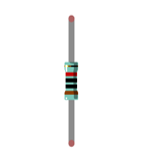
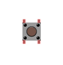
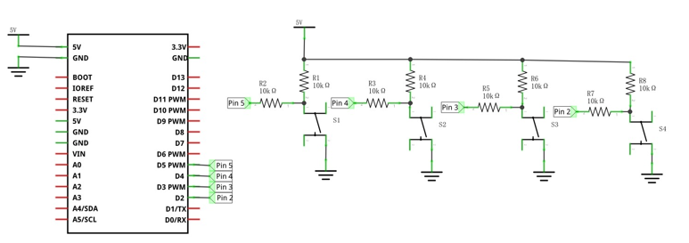
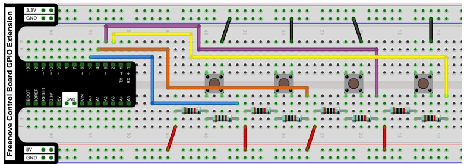
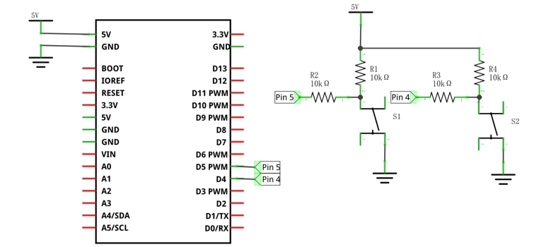
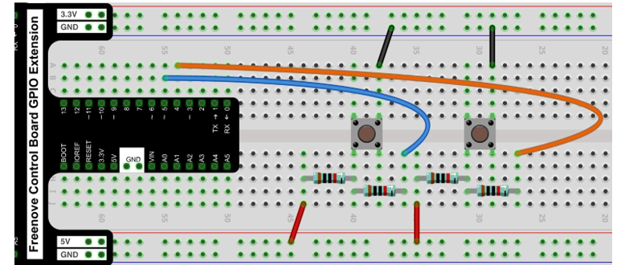

##############################################################################
Chapter USB HID 
##############################################################################

In this chapter, we will learn how to use a control board with keyboard and mouse APIs to emulate mouse and keyboard actions. This feature can be used to create game controllers, keyboard extensions, or other Human Interface Devices (HID).

Project Mouse control
*************************************

In this project, we learn how to emulate a mouse control.

Component List
==============================

+----------------------------------------------------------------------------+
| Control board x1                                                           |
|                                                                            |
| |Chapter01_00|                                                             |
+--------------------------+-------------------------------------------------+
| Breadboard x1            | GPIO Extension Board x1                         |
|                          |                                                 |
| |Chapter02_00|           | |Chapter02_01|                                  |
+------------------+-------+-------------------------------------------------+
| USB cable x1     | Jumper M/M x12                                          |
|                  |                                                         |
| |Chapter01_02|   | |Chapter01_03|                                          |
+------------------+------+--------------------------------------------------+
| Resistor 10kΩ x8        | Push button Switch x4                            |
|                         |                                                  |
| |Chapter42_00|          |  |Chapter42_01|                                  |
+-------------------------+--------------------------------------------------+

.. |Chapter01_00| image:: ../_static/imgs/1_LED_Blink/Chapter01_00.png
.. |Chapter01_02| image:: ../_static/imgs/1_LED_Blink/Chapter01_02.png
.. |Chapter01_03| image:: ../_static/imgs/1_LED_Blink/Chapter01_03.png
.. |Chapter02_00| image:: ../_static/imgs/2_Two_LEDs_Blink/Chapter02_00.png
.. |Chapter02_01| image:: ../_static/imgs/2_Two_LEDs_Blink/Chapter02_01.png

Component knowledge
============================

Human Interface Device (HID)
----------------------------------

Human Interface Devices (HID) are devices designed for human use (such as keyboards, mice, game controllers, etc.), which often send data to the computer via USB. When you press a key on the keyboard, you send data to the computer, the computer reads the data and then activates the corresponding key.

HID, or Human-Interface Devices, is a category of computer devices designed for direct interaction with humans and are typically used for input purposes. This category includes devices such as keyboards, mice, and game controllers. With the control board (V5), you can simulate these devices, unlocking a multitude of possibilities for DIY projects.

The control board (V5) has built-in support for HID, a feature found on most modern development boards but not on previous UNO versions.

The control board (V5) is more than just a powerful development board; it also has built-in support for Human-Interface Devices (HID). This allows you to use the board to simulate devices such as mice and keyboards, adding a new level of interactivity to your projects.

Circuit
============================

.. list-table:: 
   :width: 100%
   :align: center

   * -  Schematic diagram
   * -  |Chapter42_02|
   * -  Hardware connection 
     
        If you need any support, please feel free to contact us via: support@freenove.com

   * -  |Chapter42_03|

Sketch
=============================

Sketch_42.1.1
-------------------------

Upload the code to the control board, and you can easily control the movement of the mouse with the buttons. Here, four buttons are set up to control the mouse for moving up, down, left, and right.

The following is the program code:

.. literalinclude:: ../../../freenove_Kit/Sketches/Sketch_42.1.1_HID_Mouse/Sketch_42.1.1_HID_Mouse.ino
    :linenos: 
    :language: c
    :lines: 1-95
    :dedent:

Include the mouse library for mouse control.

.. literalinclude:: ../../../freenove_Kit/Sketches/Sketch_42.1.1_HID_Mouse/Sketch_42.1.1_HID_Mouse.ino
    :linenos: 
    :language: c
    :lines: 12-12
    :dedent:

Determine whether a button is press, and execute corresponding mouse movement.

.. literalinclude:: ../../../freenove_Kit/Sketches/Sketch_42.1.1_HID_Mouse/Sketch_42.1.1_HID_Mouse.ino
    :linenos: 
    :language: c
    :lines: 29-49
    :dedent:

Project Keypad Control
**************************************

In this project, we will control keyboard input through buttons.

Component List 
=========================

+----------------------------------------------------------------------------+
| Control board x1                                                           |
|                                                                            |
| |Chapter01_00|                                                             |
+--------------------------+-------------------------------------------------+
| Breadboard x1            | GPIO Extension Board x1                         |
|                          |                                                 |
| |Chapter02_00|           | |Chapter02_01|                                  |
+------------------+-------+-------------------------------------------------+
| USB cable x1     | Jumper M/M x12                                          |
|                  |                                                         |
| |Chapter01_02|   | |Chapter01_03|                                          |
+------------------+------+--------------------------------------------------+
| Resistor 10kΩ x8        | Push button Switch x4                            |
|                         |                                                  |
| |Chapter42_00|          |  |Chapter42_01|                                  |
+-------------------------+--------------------------------------------------+

Circuit
============================

.. list-table:: 
   :width: 100%
   :align: center

   * -  Schematic diagram
   * -  |Chapter42_04|
   * -  Hardware connection 
     
        If you need any support, please feel free to contact us via: support@freenove.com

   * -  |Chapter42_05|

Sketch
=============================

Sketch_42.2.1
------------------------------

Upload the code to the control board, and you can easily control keyboard input through buttons. Here, two buttons are set up: one for copying (simultaneously pressing the CTRL and C keys on the keyboard), and the other for pasting (simultaneously pressing the CTRL and V keys on the keyboard). We can use these two buttons to complete the copy and paste of text. For example, to copy the text "Freenove.com" from the file "test.txt," use the mouse to select the text, press the copy button, and then press the paste button to perform the text copy. 

The following is the program code: 

.. literalinclude:: ../../../freenove_Kit/Sketches/Sketch_42.2.1_HID_Keyboard/Sketch_42.2.1_HID_Keyboard.ino
    :linenos: 
    :language: c
    :lines: 1-38
    :dedent:

Include the Keyboard library to enable keyboard functionalities

.. literalinclude:: ../../../freenove_Kit/Sketches/Sketch_42.2.1_HID_Keyboard/Sketch_42.2.1_HID_Keyboard.ino
    :linenos: 
    :language: c
    :lines: 11-11
    :dedent:

Determine whether a button is pressed, and execute corresponding key input values.

.. literalinclude:: ../../../freenove_Kit/Sketches/Sketch_42.2.1_HID_Keyboard/Sketch_42.2.1_HID_Keyboard.ino
    :linenos: 
    :language: c
    :lines: 25-37
    :dedent:

For more examples of USB HID, please refer to:

https://docs.arduino.cc/tutorials/uno-r4-minima/usb-hid/